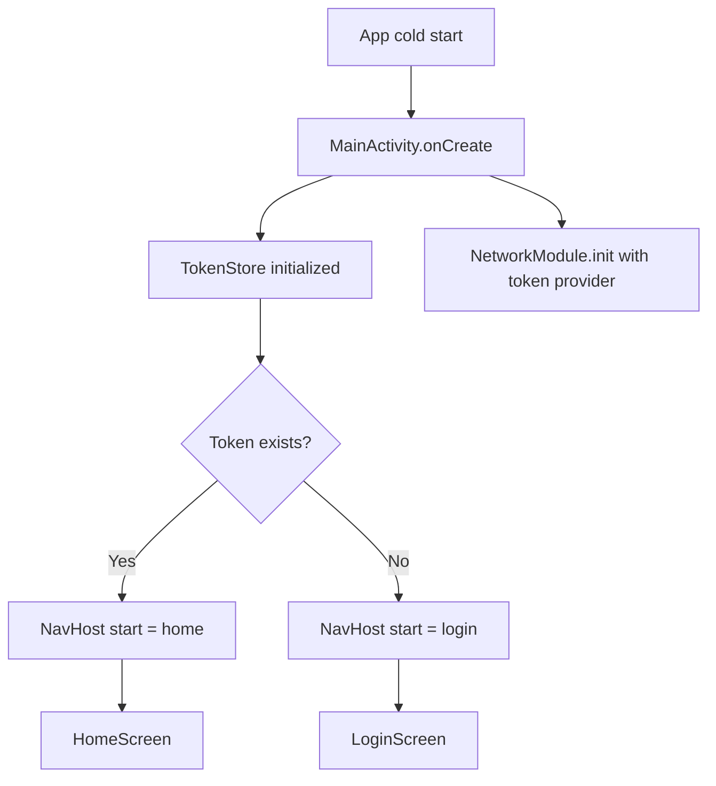
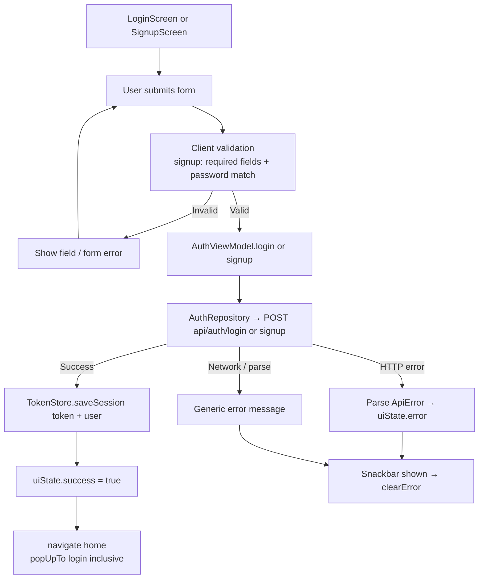
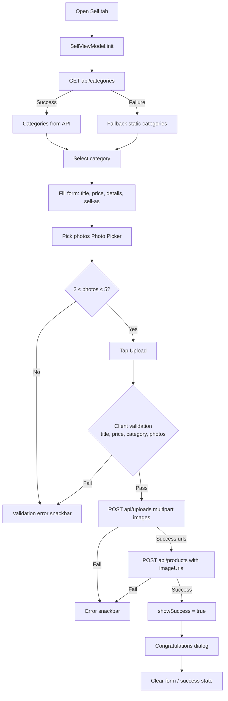
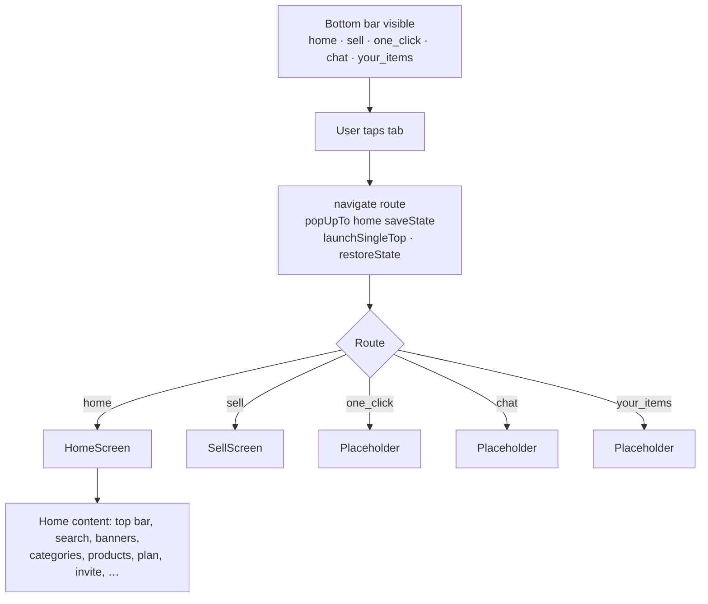

# Flow Diagrams — BID.AI Android App

Mermaid diagrams for client-side flows. API endpoint details are out of scope (see your API/Postman docs).

---

## 1. App launch & session gate

---

## 2. Authentication (login / signup)

**Cross-links:** Login → Signup (`navigate("signup")`), Signup → Login (`popBackStack`).

---

## 3. Sell listing flow (end-to-end)

**Notes:**
- Category ids: API slug → UI model (`apiId` for create).
- `sell_as`: business → `vendor`, individual → `individual`.
- Concurrent submits blocked while `isSubmitting`.

---

## 4. Bottom navigation (tabs)

Bottom bar is hidden on `login` and `signup`.

---

## 5. Layer / call sequence (sell submit)

```mermaid
sequenceDiagram
    participant UI as SellScreen
    participant VM as SellViewModel
    participant Repo as SellRepository
    participant API as Backend API
    participant Store as TokenStore

    UI->>VM: submit(photos, fields)
    VM->>VM: validate title/price/photos/category
    VM->>Repo: uploadImages(uris)
    Repo->>Store: read session (via interceptor)
    Repo->>API: POST /api/uploads
    API-->>Repo: urls
    Repo-->>VM: Result.success(urls)
    VM->>Repo: CreateProductRequest(...)
    Repo->>API: POST /api/products
    API-->>Repo: product
    Repo-->>VM: Result.success
    VM-->>UI: showSuccess = true
    UI->>UI: Congratulations dialog
```

---

## Related docs

- [Tech stack](tech-stack.md) — versions, architecture, endpoints inventory
